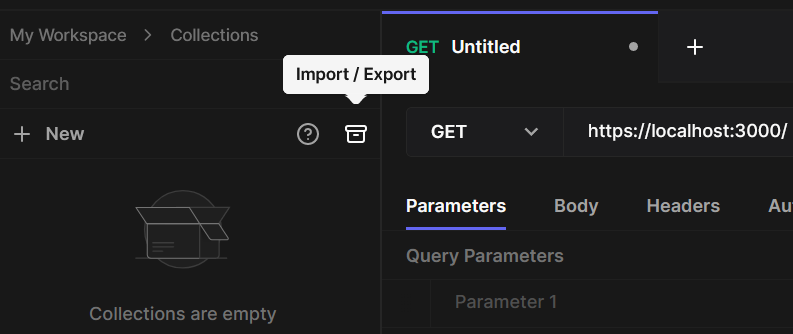
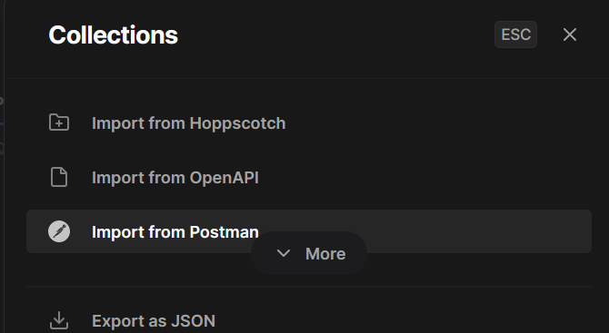
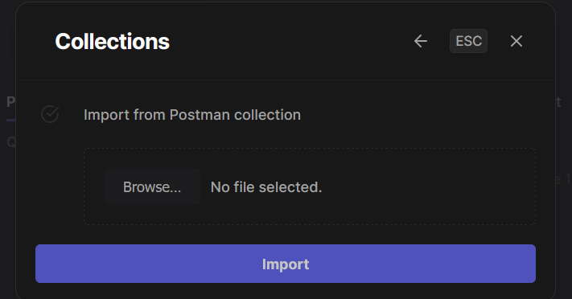

# How to Test
For Testing, there is a custom Postman Collection included in the resources folder

## Import Collection in Hoppscotch
If you are using Hoppscotch instead of Postman, you can import the Collection anyway. 

### Here is how: 

1. Click on the 'Import/Export' Button in Hoppscotch 

2. Select 'Import from Postman' 
 

3. Select the Collection to import and press 'Import' 
 

